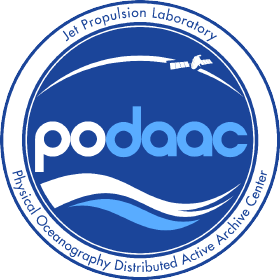

# SWOT Hydrology Data Tutorials

Here are Hydrology-relevant tutorials and resources for the Surface Water and Ocean Topography (SWOT) Mission, using cloud computing or via local machine.


```{admonition} Warning
:class: warning

These depict the most simple and commonly used methods to our knowledge to get a hand on SWOT HR products.  
Should you have other methods or tools, please share!
```

## Tutorials

````{grid} 1 1 2 2
:gutter: 2

```{grid-item-card} Basic Gallery
:link: basic
:link-type: doc
```

```{grid-item-card} Intermediate Gallery
:link: intermediate
:link-type: doc
```

```{grid-item-card} Expert Gallery
:link: expert
:link-type: doc
```
````

```{toctree}
:hidden:
:maxdepth: 1

basic
intermediate
expert
```

---

## Data Portals

| | |
|---|---|
| {width=30%} | {width=15%} |

All SWOT Hydrology data illustrated in these tutorials can be accessed via:

- [PO.DAAC Earthdata](https://search.earthdata.nasa.gov/search?portal=podaac-cloud): search for, visualize and download all SWOT products via interactive GUI developed by NASA and PO.DAAC, Earthdata
- [hydroweb.next](https://hydroweb.next.theia-land.fr/): search for, visualize, and download SWOT Hydrology products via interactive GUI developed by CNES and Theia, hydroweb.next

---

## Other useful tools

- [Hydrocron](https://podaac.github.io/hydrocron/intro.html): An API that repackages the river shapefile dataset (L2_HR_RiverSP) into CSV or GeoJSON formats for easier time-series analysis.
- [SWODLR](https://github.com/podaac/swodlr): A system for generating on-demand raster products from SWOT L2 raster data with custom resolutions, projections, and extents. *(in development)*
- [SWOT Hydrology Toolbox](https://github.com/CNES/swot-hydrology-toolbox): Together with RiverObs, open-source tools to generate virtually all SWOT HR L2 products with fairly (but not fully) representative characteristics.
- [SWOT RiverObs Tool](https://github.com/SWOTAlgorithms/RiverObs.git): Together with SWOT Hydrology Toolbox, enables generation of SWOT HR L2 products.

---

## A Priori Databases

- [SWOT River Database (SWORD)](https://www.swordexplorer.com/): Database for rivers SWOT products are based upon; great for discovering river reach IDs. Available also via [hydroweb.next](https://hydroweb.next.theia-land.fr/?pid=SWOT_PRIOR_RIVER_DATABASE)
- [Prior Lake Database (PLD)](https://hydroweb.next.theia-land.fr/?pid=SWOT_PRIOR_LAKE_DATABASE):
  - Add the PLD layer into hydroweb.next to see the lakes SWOT products are based upon, great for discovering lake IDs!
  - Ask for PLD updates on the page :ref:`pld-label`

---

## Products Description

- [SWOT Data User Handbook](https://archive.podaac.earthdata.nasa.gov/podaac-ops-cumulus-docs/web-misc/swot_mission_docs/D-109532_SWOT_UserHandbook_20240502.pdf?_ga=2.124259722.1042075570.1716930479-1354658737.1715875596): first reference document
- [Product Description Documents](https://podaac.jpl.nasa.gov/SWOT?tab=datasets-information): more detailed product information
- [Latest Release Notes – Version C KaRIn Science Data Products](https://archive.podaac.earthdata.nasa.gov/podaac-ops-cumulus-docs/web-misc/swot_mission_docs/releases/SWOT_VersionC_KaRIn_Products_Release_Note.pdf): See section 6 for current issues and features

---

## Additional Resources

- [PO.DAAC Cookbook: SWOT Chapter](https://podaac.github.io/tutorials/quarto_text/SWOT.html): data resources, tips, tutorials for hydrology and oceanography SWOT communities
- [GIS SWOT StoryMap](https://storymaps.arcgis.com/stories/4a9184e813e540248040069580f6a54c)

---

## Features of KaRIn Data that Users Should be Aware of

- [Slide Deck Presented at the SWOT Science Team by Curtis Chen](https://swotst.aviso.altimetry.fr/fileadmin/user_upload/SWOTST2023/20230919_3_Karin_overview2/14h10-KaRInFeatures.pdf): Addresses practical aspects of interpreting SWOT KaRIn data products, answers FAQs, and provides tips to avoid misinterpretation.

---

## Earthdata Webinar

- [Accessing Data for the World's Water with SWOT](https://www.earthdata.nasa.gov/learn/webinars-and-tutorials/webinar-podaac-2024-03-20): Watch the recording! Learn to discover, access, and use SWOT mission data from PO.DAAC.

---

## 2024 SWOT Hydrology Data Access Workshop

[SWOT 2024 Hydrology Workshop](https://podaac.github.io/2024-SWOT-Hydro-Workshop/)
